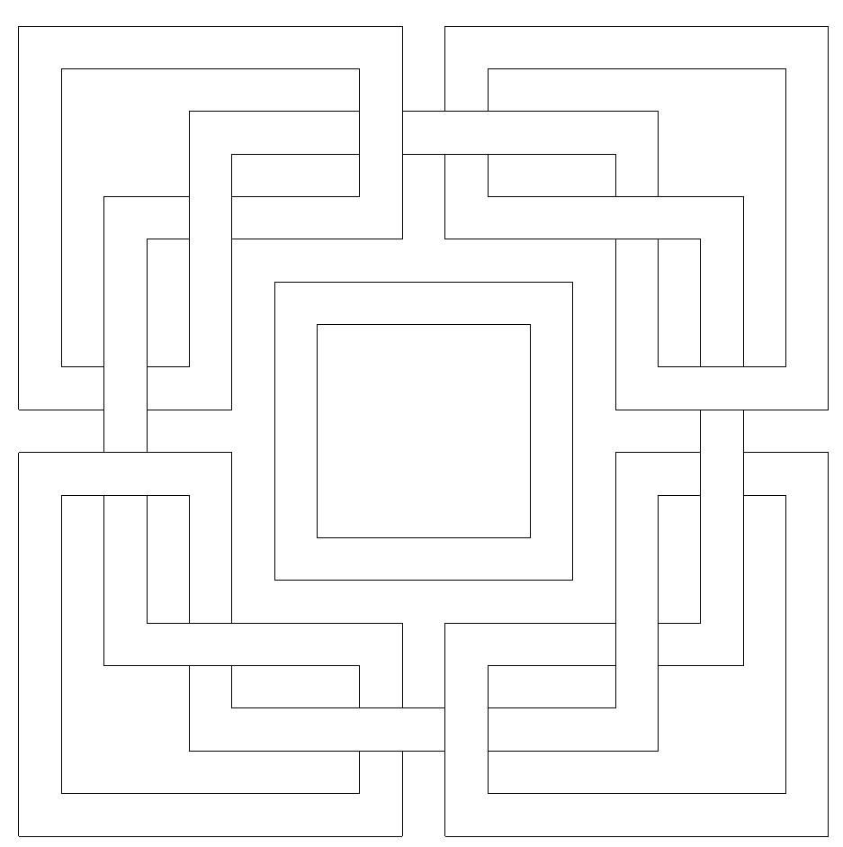

# Laberinto OpenGL

Este es un proyecto de OpenGL que renderiza un laberinto utilizando **GLFW**, **GLAD** y **GLM**.

link para instalar openGL en VSCode: [text](https://www.youtube.com/watch?v=Y4F0tI7WlDs)


## 📦 Requisitos

Asegúrate de tener instaladas las siguientes dependencias:

### **1️⃣ Instalación de herramientas y compiladores**

Antes de compilar el proyecto, necesitas instalar un compilador de C++ y herramientas necesarias:

#### **Windows (MSYS2 - MinGW)**

1. **Descargar e instalar** [MSYS2](https://www.msys2.org/).
2. **Abrir MSYS2 UCRT64 y ejecutar:**

```sh
pacman -S mingw-w64-x86_64-gcc mingw-w64-x86_64-glfw mingw-w64-x86_64-glew
```

#### **Linux (Ubuntu/Debian)**

```sh
sudo apt update
sudo apt install g++ cmake make libglfw3-dev libglew-dev libgl1-mesa-dev libglu1-mesa-dev
```

#### **MacOS (Homebrew)**

```sh
brew install glfw glew
```

### **2️⃣ Instalación de Extensiones en VS Code**
Para compilar dentro de **Visual Studio Code**, instala las siguientes extensiones:

- **C/C++** (by Microsoft)
- **Code Runner** (by Jun Han)
- **CMake Tools** (si usas CMake)

Puedes instalarlas desde la pestaña de **Extensiones (`CTRL+SHIFT+X`)** en VS Code.

---

## 🔧 **Compilación y Ejecución**

### **Opción 1: Compilar con VS Code (Recomendado)**

1. Abre el proyecto en **VS Code**.
2. Presiona **`CTRL + SHIFT + B`** (Ejecutar tarea de compilación).
3. Una vez compilado, ejecuta:

```sh
./dibujo.exe
```

---

### **Opción 2: Compilar manualmente con g++**
Si no usas **VS Code**, compila manualmente:

```sh
g++ -o dibujo src/main.cpp src/glad.c -Iinclude -Llib -lglfw3dll -ldl -lopengl32 -lgdi32
./dibujo
```

---

### **Opción 3: Usar CMake (Opcional)**
Si prefieres **CMake**, usa:

```sh
mkdir build && cd build
cmake ..
make
./laberinto
```

---

## 📜 **Estructura del Proyecto**
```
Dibujo 2D 02-SegundoTrabajoLaboratorio/
│── include/        # Cabeceras de OpenGL, GLFW, GLM
│   ├── glad/       # Contiene glad.h
│── lib/            # Librerías precompiladas (deben estar presentes)
│── src/            # Código fuente
│   ├── glad.c      # Implementación de GLAD
│── .vscode/        # Configuración de VS Code (incluye tasks.json)
│── CMakeLists.txt  # Archivo de CMake (opcional)
│── README.md       # Instrucciones de compilación
│── .gitignore      # Archivos a ignorar en Git
```

---

## 🚀 **Notas**
- Asegúrate de tener **GLAD, GLFW y las librerías necesarias** en `include/` y `lib/`.
- Si el comando `CTRL + SHIFT + B` no compila, revisa `tasks.json`.
- Si `lib/` no está al clonar, verifica `.gitignore` y sube los archivos manualmente.
- Para asegurarte de que `g++` está instalado, ejecuta `g++ --version` en la terminal.

Cualquier duda, ¡pregunta! 😊

